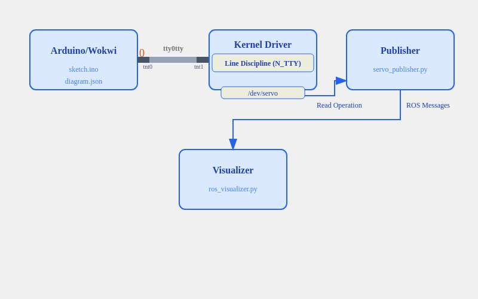

# Servo Control System: Technical Documentation

## Data Flow Visualization



The above animation demonstrates how data flows through our servo control system. Let's break down each step:

### 1. Serial Communication (Arduino/Wokwi → tty0tty)
- Data is sent character by character over serial
- In the example, the value "90" is transmitted as:
  1. First character: "0"
  2. Second character: "9"
  3. Finally, a newline character "\n"

### 2. Virtual Serial Port (tty0tty)
- Acts as a virtual pipe between Arduino and the kernel
- tnt0: Receives data from Arduino/Wokwi
- tnt1: Forwards data to kernel driver

### 3. Kernel Processing (Line Discipline)
- Line discipline (N_TTY) buffers incoming characters
- Once a complete line is received ("90\n")
- Processes the data as a complete message
- Converts the string to a numerical value

### 4. Device File Interface
- Processed value is made available through `/dev/servo`
- Publisher can read the current angle via this device file
- Provides a clean interface between kernel and user space

### 5. ROS Communication
- Publisher reads the processed value
- Publishes it to the ROS network
- Visualizer receives and displays the servo position

## Key Features

1. **Character-by-Character Processing**
   - Serial data is processed one character at a time
   - Demonstrates real-world UART communication

2. **Data Buffering**
   - Line discipline buffers incoming characters
   - Ensures complete messages before processing

3. **Clean Interfaces**
   - tty0tty provides hardware abstraction
   - Device file separates kernel and user space
   - ROS messaging for high-level communication

## Implementation Notes

### Line Discipline Configuration
```c
// Kernel module configuration
#define N_TTY 0
#define SERVO_BUF_SIZE 256
```

### Device File Operations
```c
// Read operation from user space
static ssize_t dev_read(struct file *filep, char *buffer, size_t len, loff_t *offset)
{
    // Return current servo angle
    ...
}
```

### Publisher Integration
```python
# Reading from device file
with open('/dev/servo', 'r') as f:
    angle = int(f.read().strip())
```

## Common Issues and Debugging

1. **Serial Communication**
   - Check if data is visible in tty0tty pipe
   - Verify correct baud rate and serial settings
   - Monitor character-by-character transmission

2. **Line Discipline**
   - Check dmesg for line discipline registration
   - Verify buffer sizes and processing
   - Monitor complete message assembly

3. **Device File**
   - Verify permissions and access
   - Check if values are updating
   - Monitor read operations

## Further Reading

- [tty0tty Documentation](https://github.com/freemed/tty0tty)
- [Linux Line Disciplines](https://www.kernel.org/doc/html/latest/driver-api/tty/tty_ldisc.html)
- [ROS Publishers and Subscribers](http://wiki.ros.org/ROS/Tutorials/WritingPublisherSubscriber)
